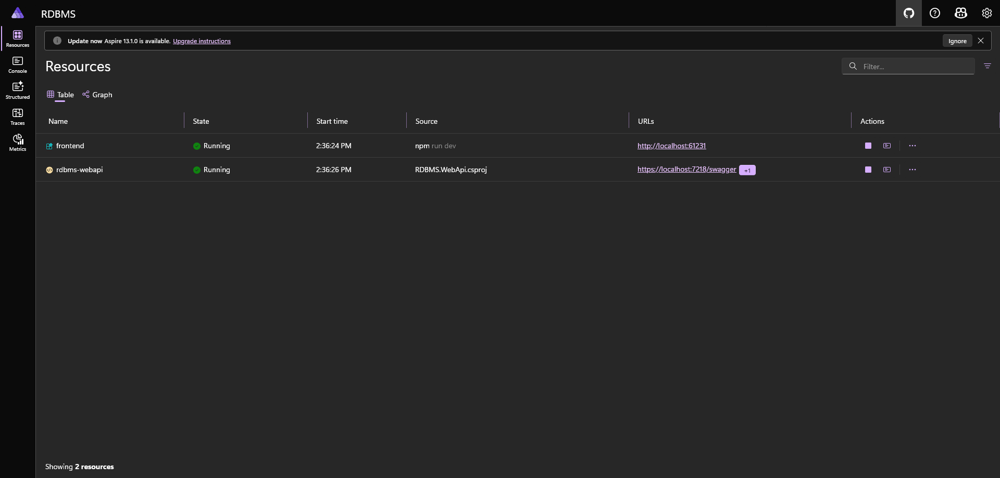
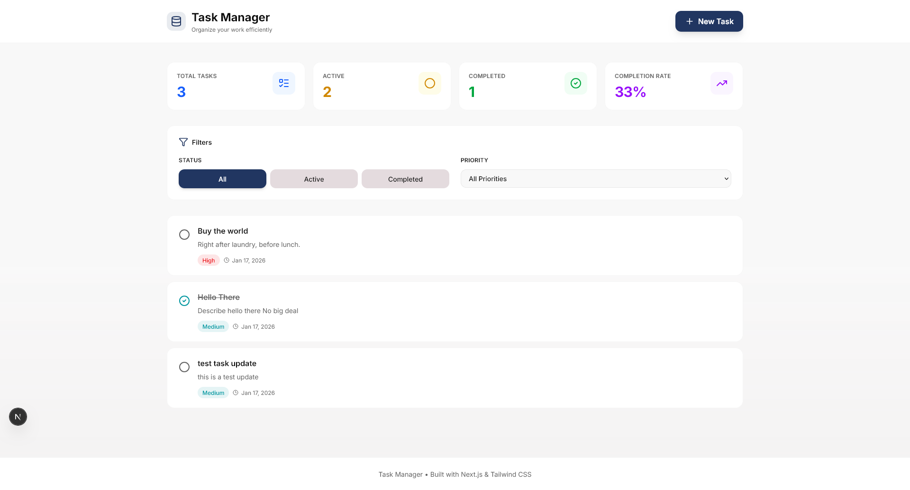
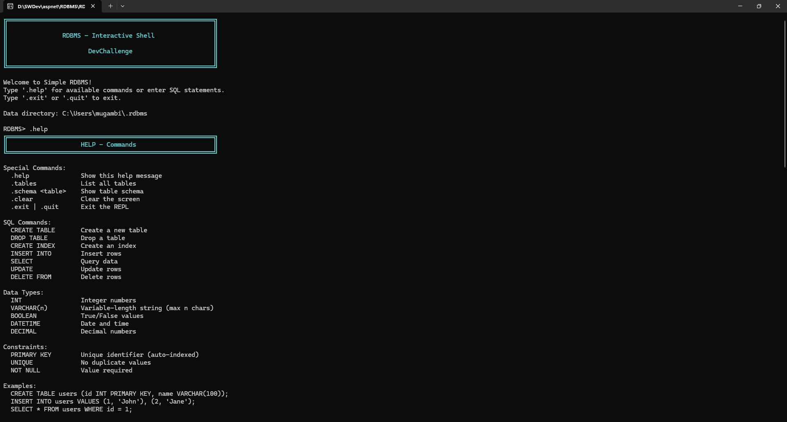

# SimpleRDBMS - Custom Relational Database System

A lightweight, SQL-compatible RDBMS built from scratch in C# for the Pesapal Junior DevChallenge '26.

## Quick Start

### Prerequisites
- .NET 6+ SDK
- Terminal/Command Prompt

### Installation & Run

#### Quick Start (The Aspire Way)
```bash
# Clone repository
git clone <repository-url>
cd RDBMS

# Run the entire distributed application
dotnet run --project RDBMS.AppHost
```
Once running, open the Aspire Dashboard URL provided in the terminal to monitor the Web API and Frontend.


Sample task management app can be found y browsing to the respective url


#### Running the Interactive REPL (CLI)
Since .NET Aspire redirects console output to a web dashboard, the dashboard view is read-only. 
To use the interactive shell (REPL) where you can type commands:

```bash


# In Terminal (Start the Interactive Shell)
cd RDBMS.CLI
dotnet run 
#or
dotnet run -- --data ~/.rdbms 
```

## Core Features

- ✅ **SQL Parser & Executor** - Custom tokenizer and recursive descent parser
- ✅ **CRUD Operations** - INSERT, SELECT, UPDATE, DELETE
- ✅ **JOIN Support** - INNER JOIN and LEFT JOIN
- ✅ **Constraints** - PRIMARY KEY, UNIQUE, NOT NULL
- ✅ **Indexes** - Hash-based indexing for performance
- ✅ **JSON Storage** - Human-readable file-based persistence
- ✅ **Interactive REPL** - Command-line interface with pretty-printed results

## Supported SQL Commands

### Data Definition Language (DDL)

```sql
-- Create table with constraints
CREATE TABLE users (
    id INT PRIMARY KEY,
    name VARCHAR(100) NOT NULL,
    email VARCHAR(255) UNIQUE,
    age INT,
    active BOOLEAN,
    created_at DATETIME
);

-- Create index
CREATE INDEX idx_email ON users(email);

-- Drop table
DROP TABLE users;
```

### Data Manipulation Language (DML)

```sql
-- Insert single row
INSERT INTO users (id, name, email, age) 
VALUES (1, 'John Doe', 'john@example.com', 25);

-- Insert multiple rows
INSERT INTO users (id, name, age) VALUES 
    (2, 'Jane Smith', 30),
    (3, 'Bob Johnson', 35);

-- Select all columns
SELECT * FROM users;

-- Select with WHERE clause
SELECT name, email FROM users WHERE age > 25;

-- Compound WHERE conditions
SELECT * FROM users WHERE age > 25 AND active = TRUE;

-- Update records
UPDATE users SET age = 26 WHERE id = 1;

-- Delete records
DELETE FROM users WHERE id = 1;
```

### JOIN Operations

```sql
-- Inner Join
SELECT users.name, orders.product 
FROM users 
INNER JOIN orders ON users.id = orders.user_id;

-- Left Join
SELECT users.name, orders.product 
FROM users 
LEFT JOIN orders ON users.id = orders.user_id;
```

## Data Types

| Type | Description | Example |
|------|-------------|---------|
| `INT` | Integer numbers | `42`, `-100` |
| `VARCHAR(n)` | String (max n chars) | `'John Doe'` |
| `BOOLEAN` | True/False | `TRUE`, `FALSE` |
| `DATETIME` | Date and time | `'2026-01-01 10:00:00'` |
| `DECIMAL` | Decimal numbers | `99.99`, `3.14` |

## Interactive Shell Commands

| Command | Description |
|---------|-------------|
| `.help` | Show help information |
| `.tables` | List all tables |
| `.schema <table>` | Show table schema |
| `.clear` | Clear screen |
| `.exit` | Exit the shell |

## Example Session

```sql
RDBMS> CREATE TABLE tasks (
         ...>     id INT PRIMARY KEY,
         ...>     title VARCHAR(200) NOT NULL,
         ...>     completed BOOLEAN
         ...> );
Table 'tasks' created successfully.

RDBMS> INSERT INTO tasks VALUES 
         ...>     (1, 'Build RDBMS', FALSE),
         ...>     (2, 'Create demo', FALSE);
Inserted 2 row(s).

RDBMS> SELECT * FROM tasks;
+----+------------------+-----------+
| id | title            | completed |
+----+------------------+-----------+
|  1 | Build RDBMS      | FALSE     |
|  2 | Create demo      | FALSE     |
+----+------------------+-----------+
2 row(s) returned.

RDBMS> UPDATE tasks SET completed = TRUE WHERE id = 1;
Updated 1 row(s).

RDBMS> .tables
Tables (1):
  • tasks
```

## Demo Script

A comprehensive demo script is included at `demo.sql`. Run it to see all features in action:

```bash
# From the REPL, you can manually execute each line
# Or reference it for SQL examples
```

The demo script covers:
- Table creation with all data types
- Index creation
- Single and bulk inserts
- SELECT queries with WHERE clauses
- INNER and LEFT JOINs
- UPDATE operations
- DELETE operations

## Architecture

```
┌──────────────────────────────────────┐
│        Interactive REPL              │
│          (RDBMS.CLI)                 │
└─────────────┬────────────────────────┘
              │ SQL String
              ▼
┌──────────────────────────────────────┐
│         SQL Parser                   │
│  Tokenizer → Parser → Query Object   │
└─────────────┬────────────────────────┘
              │
              ▼
┌──────────────────────────────────────┐
│       Query Executor                 │
│  Routes to specific executors        │
│  (INSERT/SELECT/UPDATE/DELETE)       │
└─────────────┬────────────────────────┘
              │
              ▼
┌──────────────────────────────────────┐
│      Storage Engine                  │
│  Manages tables, indexes, files      │
│  Persists to JSON files              │
└──────────────────────────────────────┘
```

## Project Structure

```
RDBMS/
├── RDBMS.AppHost/            # .NET Aspire Orchestrator (Startup Project)
├── RDBMS.ServiceDefaults/    # Shared telemetry & health checks
├── RDBMS.Core/               # Core RDBMS engine (Parsing, Storage, Execution)
├── RDBMS.WebApi/             # ASP.NET Core API wrapper
├── RDBMS.CLI/                # Interactive shell (REPL)
├── rbdms-client/             # Next.js Frontend Dashboard
└── RDBMS.Tests/              # Test suite (145+ tests)
```

## Data Storage

Data is stored in `~/.rdbms/` (or custom directory):

```
.rdbms/
├── users_schema.json      # Table schema definition
├── users_data.json        # Table data
└── users_idx_email.json   # Index files
```

All files are human-readable JSON for easy inspection.

## Key Design Decisions

### Parser Implementation
- **Recursive descent parser** built from scratch
- No external dependencies (no ANTLR)
- Full control over error messages
- Educational demonstration of compiler theory

### Storage Format
- **JSON files** (one per table)
- Human-readable for debugging
- Simple serialization with System.Text.Json
- Easy to inspect and validate

### Index Implementation
- **Hash-based** using Dictionary<object, List<int>>
- O(1) lookup for equality checks
- Sufficient for demonstration purposes

### JOIN Algorithm
- **Nested loop join**
- O(n*m) complexity
- Simple, reliable, works for all join types
- Good for small to medium datasets

## Testing

```bash
# Run all tests (145+ test cases)
cd RDBMS.Tests
dotnet test

# Run specific test suite
dotnet test --filter "FullyQualifiedName~TokenizerTests"
dotnet test --filter "FullyQualifiedName~ParserTests"
dotnet test --filter "FullyQualifiedName~QueryExecutorTests"
```

**Test Coverage:**
- 60+ Tokenizer tests
- 45+ Parser tests  
- 40+ Query Executor tests

## Constraints & Validation

The system enforces:
- **PRIMARY KEY** - Unique, non-null, auto-indexed
- **UNIQUE** - No duplicate values
- **NOT NULL** - Value required
- **VARCHAR length** - Maximum character validation
- **Data type** - Type checking and conversion

## Known Limitations

- No transactions (auto-commit mode only)
- No foreign key constraints
- No aggregate functions (COUNT, SUM, AVG, etc.)
- No subqueries
- Linear scan for WHERE clauses without indexes
- Basic ORDER BY (implemented but limited testing)

## Performance Targets

For datasets < 10,000 rows:
- INSERT: < 10ms
- SELECT with index: < 50ms
- SELECT without index: < 100ms
- UPDATE/DELETE: < 100ms
- INNER JOIN (100x100): < 200ms

## Error Handling

The system provides clear error messages:

```sql
RDBMS> SELECT * FROM nonexistent;
Error: Table 'nonexistent' not found.

RDBMS> INSERT INTO users (id) VALUES (1), (1);
Error: PRIMARY KEY constraint violation: Duplicate value '1' for column 'id'.
```


## Quick Tips

1. **Multi-line SQL**: Press Enter to continue. End with `;`
2. **Case Sensitivity**: Keywords are case-insensitive, but table/column names are case-sensitive
3. **String Literals**: Use single or double quotes: `'text'` or `"text"`
4. **Comments**: Use `--` for line comments or `/* */` for blocks
5. **Data Persistence**: All data auto-saves to disk